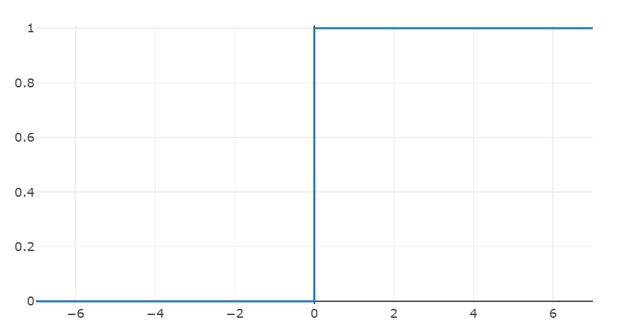
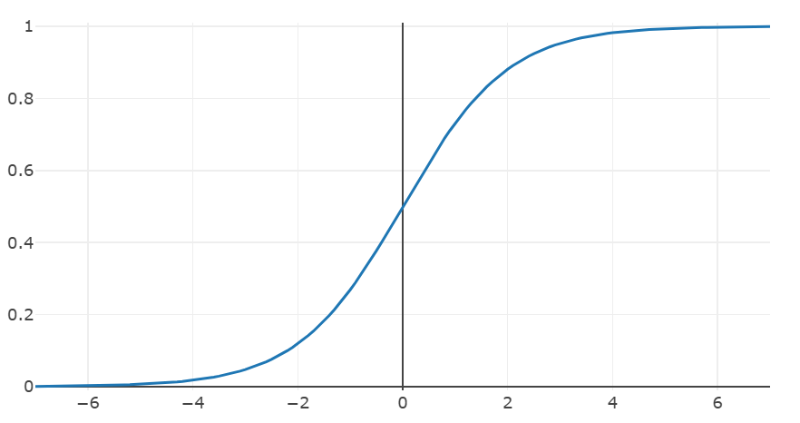
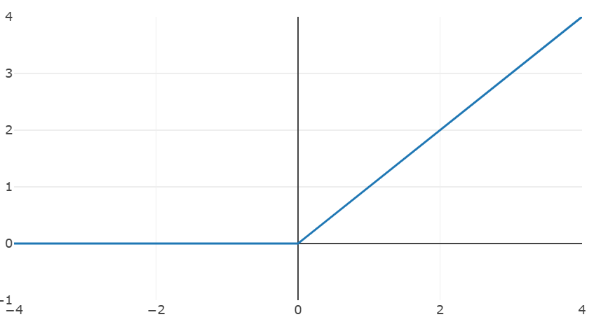

# 밑바닥부터 시작하는 딥러닝

 

## Non linear function

- 계단(0, 1), sigmoid, ReLU

  ### 층을 깊게 쌓는데 의의가 있는 신경망에서는 활성화 함수로 비선형 함수를 사용해야 한다

  -> **y = ax(선형함수)** 를 아무리 깊게 쌓아도 **y = cx**로 표현 할 수 있기 때문

 

## Activation Function

- 은닉층을 활성화 하기 위한 함수
- 비선형 함수 : 역전파 과정에서 미분값을 통해 학습 진행할 수 있게 함
-> 선형 구조라면 미분 과정에서 항상 상수 -> 학습 불가

 

### Step Function

- 0을 기준으로 0, 1 출력
- x=0 지점에서 불연속 -> 미분 x -> 학습 x

 

### Sigmoid

- 0<y<1 범위를 가짐 -> 기울기 폭주 방지
- 분류 문제 사용 가능
- 매우 큰 입력값도 1 출력 -> 기울기 소실

-> 단점이 많아 일반적으로 잘 사용하지 않음

 

### ReLU

- 학습 속도 빠름
- 기울기 소실 문제 x
- input이 음수인 경우 0반환 -> Dying ReLU

-> Hidden layer에서 가장 많이 사용

 

## Activation Function - output layer

**regression** -> identity function

**binary classification** -> sigmoid

**multi classification** -> softmax
