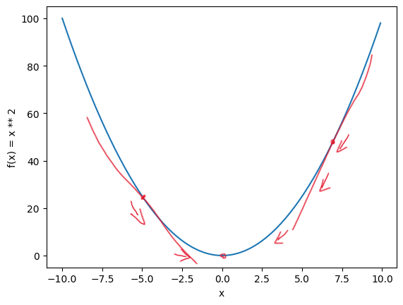
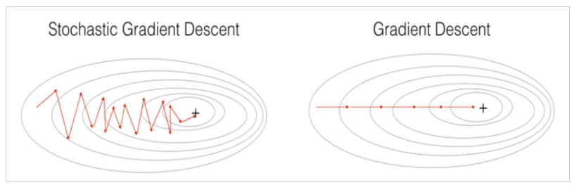

# 밑바닥부터 시작하는 딥러닝

 

## Non linear function

- 계단(0, 1), sigmoid, ReLU

  ### 층을 깊게 쌓는데 의의가 있는 신경망에서는 활성화 함수로 비선형 함수를 사용해야 한다

  -> **y = ax(선형함수)** 를 아무리 깊게 쌓아도 **y = cx**로 표현 할 수 있기 때문

 

## Activation Function 

- 은닉층을 활성화 하기 위한 함수
- 비선형 함수 : 역전파 과정에서 미분값을 통해 학습 진행할 수 있게 함
-> 선형 구조라면 미분 과정에서 항상 상수 -> 학습 불가

 

### Step Function

- 0을 기준으로 0, 1 출력
- x=0 지점에서 불연속 -> 미분 x -> 학습 x

 

### Sigmoid

- 0<y<1 범위를 가짐 -> 기울기 폭주 방지
- 분류 문제 사용 가능
- 매우 큰 입력값도 1 출력 -> 기울기 소실

-> 단점이 많아 일반적으로 잘 사용하지 않음

 

### ReLU

- 학습 속도 빠름
- 기울기 소실 문제 x
- input이 음수인 경우 0반환 -> Dying ReLU

-> Hidden layer에서 가장 많이 사용

 

## Activation Function - output layer

**regression** -> identity function

**binary classification** -> sigmoid

**multi classification** -> softmax

 

## Gradient

- 손실 함수의 값을 최소화하는 과정(학습)을 위해 미분 이용

### IDEA

- 손실 함수의 미분을 통해, + or - 방향으로 파라미터를 갱신할지 판단할 수 있음

 

 

**미분 값 : 음수 -> 양의 방향으로 이동**

**미분 값 : 양수 -> 음의 방향으로 이동**

-> global minimum(x=0.0)으로 이동, 학습하는 과정

 

## Optimizer

**최소의 loss로 학습하는 방법을 찾는 최적화 알고리즘**

-> loss function의 극솟값을 찾아내기 위한 logic들

 

### SGD & GD

 

**GD** : 모든 데이터에 대하여 경사하강법 진행
-> 속도 느림

**SGD** : 랜덤으로 일부 데이터에 대해 경사하강법 진행 -> 속도 UP!

 

### Adam(Adaptive Moment Esimation)

- momentum(관성)과 RMSProp(학습률조정)을 섞은 알고리즘
- 대부분 학습에서 사용

 

### when train Transformer

**Pre-training** : Adam

**Fine-tuning** : SGD

-> optimizer의 성질을 잘 표현한 구도

 

