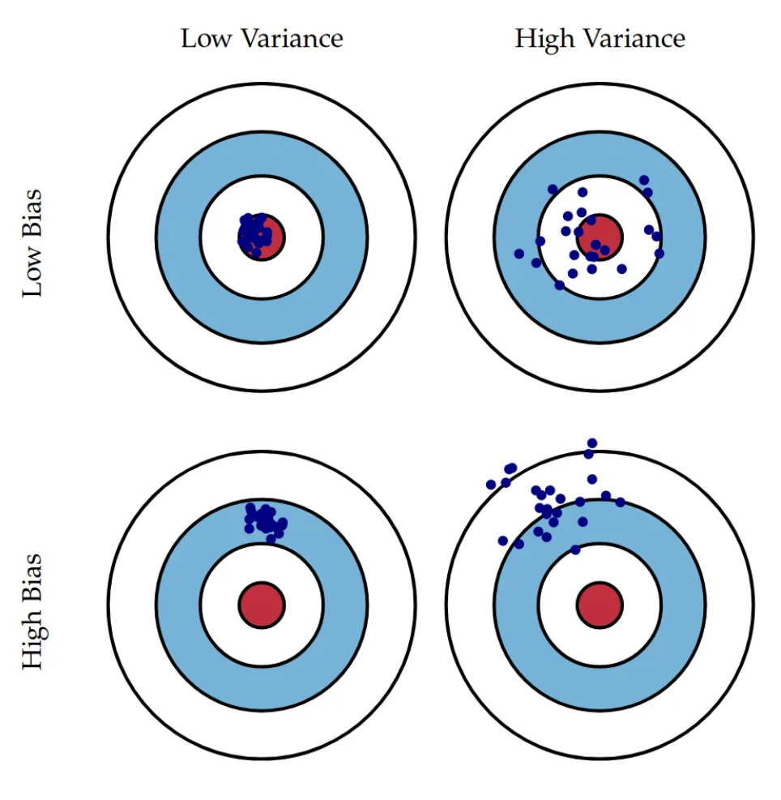
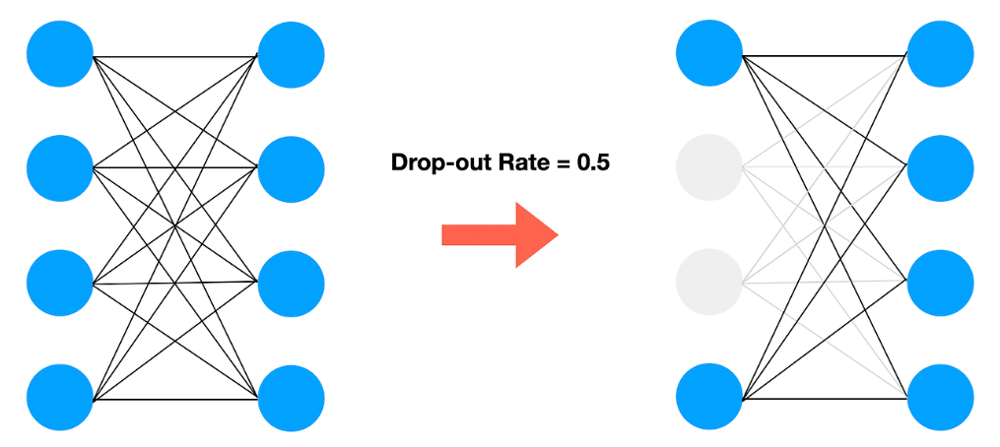

## Bias and Variance

 

**bias**
- 예측값과 정답 차이의 평균

**variance**
- 데이터셋에 대해 예측 값이 얼만큼 변할 수 있는지의 양
- high variace == high model flexibility

 

1. high bias 
-> 모델 복잡도 높임, 오랜 학습(more epoch)

2. high variance
-> 더 많은 데이터셋 구축, 정규화

 

## Dropout

**layer의 유닛을 정해진 확률로 제거하는 기법**

- overfitting, high variance 문제 해결
- 각 층마다 다른 확률 적용 가능 -> 유닛이 많은 layer일수록 (overfitting우려층) 강한 dropout 적용

---

### Regularization methods
- augmentation
- early stopping
- L2 regularization(better early stop)

 

! **Dropout Reduces Underfitting** 논문에서 dropout이 underfitting에도 효과적이라는 것을 증명

-> Dropout이 gradient의 방향을 consistent하게 만들어줌

 

## Training optimize Algorithms

### **BGD** vs **SGD** vs **MGD**

**BGD**
- 일반 경사 하강법
- 1 iter : whole data

**SGD**
- 1 iter : 1 data
- lr 낮춰서 빠르게 수렴 가능
- 벡터화(행렬 일괄 계산)의 장점 못살림 -> 속도 저하

**MGD**(mini-batch GD)
- 1 iter : size(data) / batch_size
- BGD & SGD 장점 합친 것

### when small dataset
-> BGD

 

## Momentum & RMSProp & Adam

### Momentum

- 이름대로 관성을 주는 기법

$$
v_(i+1) = m \times v_i + r \times dw
$$

 

### RMSProp - Root Mean Sqaure Propagation

- AdaGrad의 학습률 0 수렴 문제를 해결
- step마다 일정 비율로 누적하지 않고 지수이동평균에 따라 기울기 업뎃 -> 최근 기울기 많이 반영

 

### Adam

- Momentum + RMSProp

 

## Batch Normalization

**input normalization** -> 입력층의 x(input, data)를 평균을 0, 표준편차를 1로 만드는 것

 

**Batch Norm은 Input Norm과 달리 hidden layer에서 파라미터를 정규화 하는 것**

 

### 사용 효과
- layer 간 covariate shift(입력 분포 변화) 완화 -> 뒷 hidden layer의 학습 용이
- Regularization Effect(규제 효과 기대로 사용 x, 부가적인 효과임)-> drop out같은 효과

### TIP
- 활성함수 이전에 사용

  
  
  

Ref)

- https://www.youtube.com/playlist?list=PLkDaE6sCZn6Hn0vK8co82zjQtt3T2Nkqc