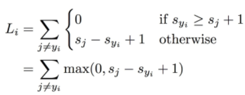
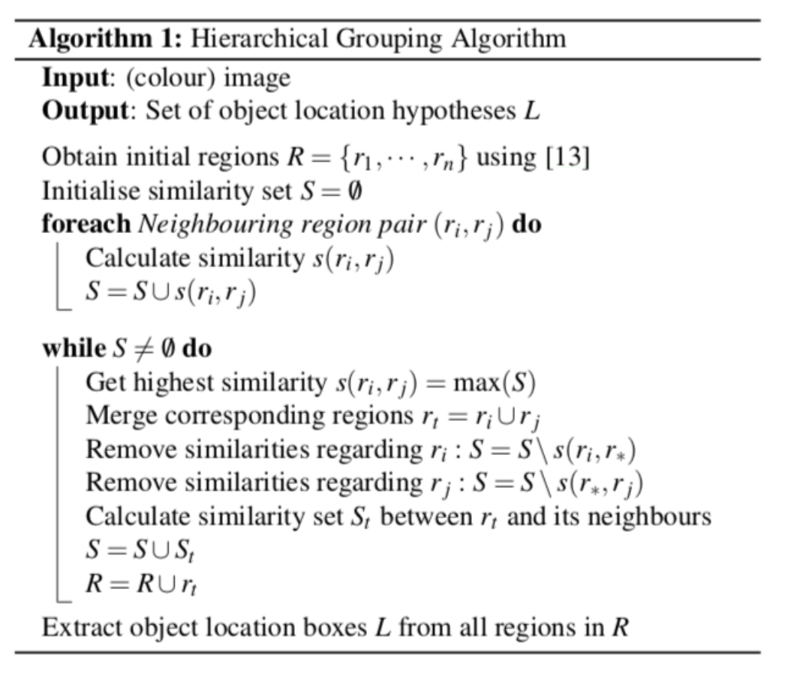

## What is L1, L2?

### L1(Manhattan distance) 

$$
abs(l1 - l2)
$$

**Loss**
- Robust <- outlier 영향 덜받음
- unstable
- multiple solution <- manhattan 특성(이동 방법 많음)

 

### L2(Euclidean distance) 

$$
(l1 - l2) ** 2
$$

**Loss**
- Not Robust
- stable
- one solution 

 

---

## SVM vs softMax

### Multiclass SVM loss

- sj : 오답클래스 예측 점수, syi : 정답클래스 예측 점수, +1 : safety margin
- (sj + 1) - syi로 식을 다시 보면, 정답클래스의 예측 점수가 다른 클래스보다 margin만큼 커야 loss가 발생 하지 않음

### SVM vs softMax

- SVM은 분류 가능한 margin 값을 찾기만 하면 끝
- softMax는 확률 질량 1 안에서 올바른 클래스의 질량을 계속해서 늘리기를 원함

 

---

## Zero-Centering

### why zero centering?

input 값이 모두 positive 이거나 negative라면 weight update 불가

-> **sigmoid function** 에서 input 값이 항상 양수

-> 한 쪽 방향으로만 weight update 될 것

### image는 zero center만

- image는 어느 정도 각 차원간에 스케일이 맞춰서 있어 normalize보단 zero center정도만

 

---
 

## Region Proposal

- Two-stage detector(RCNN) 에서 Localization + classification 과정 중 Localization 분야

 

### 1. **Sliding window**
- Window(different scale & ratio)로 모든 영역 탐색 -> many cost

if) object들이 각각 다른 shape : rectangle에 닮기지 않는 모양이라면?

-> sliding window방식 비효율적일 것
-> selective search

 

### 2. **Selective Search** (R-CNN)

 

### step
- input에 대해 segmentation 수행 -> candidate objects가 매우 많음
- iterative하게 작은 영역을 큰 영역으로 결합(아래 그림) -> candidate objects가 추려짐

 

-> 이 과정도 너무 오래걸림 -> 딥러닝으로 해결해보자 -> RPN(Region Proposal Network)

 

### 3. **RPN** (Faster R-CNN)

 

### Step
- 9개 anchor box생성 : (3가지 aspect ratio, 3가지 box scale 조합)
- ground truth와 anchor box를 regression
