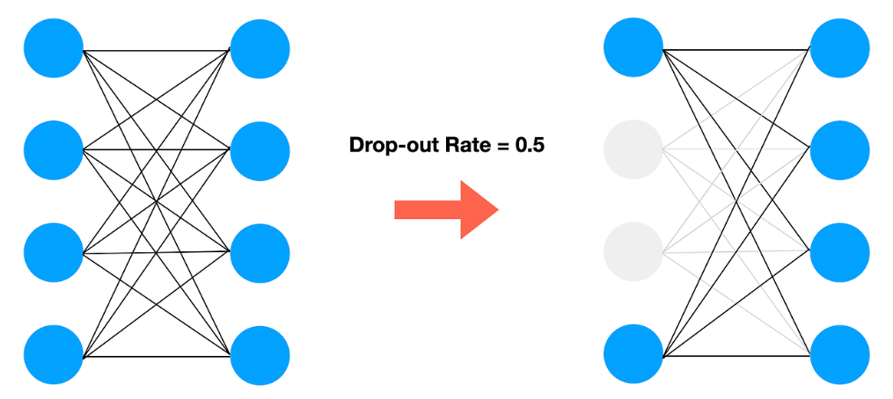

## Bias and Variance

 

**bias**
- 예측값과 정답 차이의 평균

**variance**
- 데이터셋에 대해 예측 값이 얼만큼 변할 수 있는지의 양
- high variace == high model flexibility

 

1. high bias 
-> 모델 복잡도 높임, 오랜 학습(more epoch)

2. high variance
-> 더 많은 데이터셋 구축, 정규화

 

## Dropout

**layer의 유닛을 정해진 확률로 제거하는 기법**

- overfitting, high variance 문제 해결
- 각 층마다 다른 확률 적용 가능 -> 유닛이 많은 layer일수록 (overfitting우려층) 강한 dropout 적용

---

### Regularization methods
- augmentation
- early stopping
- L2 regularization(better early stop)

 

! **Dropout Reduces Underfitting** 논문에서 dropout이 underfitting에도 효과적이라는 것을 증명

-> Dropout이 gradient의 방향을 consistent하게 만들어줌

 

## Training optimize Algorithms

### **BGD** vs **SGD** vs **MGD**

**BGD**
- 일반 경사 하강법
- 1 iter : every data

**SGD**
- 1 iter : 1 sample data

**MGD**(mini-batch GD)
- 1 iter : size(data) / batch_size

---

  
  
  

Ref)

- https://www.youtube.com/playlist?list=PLkDaE6sCZn6Hn0vK8co82zjQtt3T2Nkqc