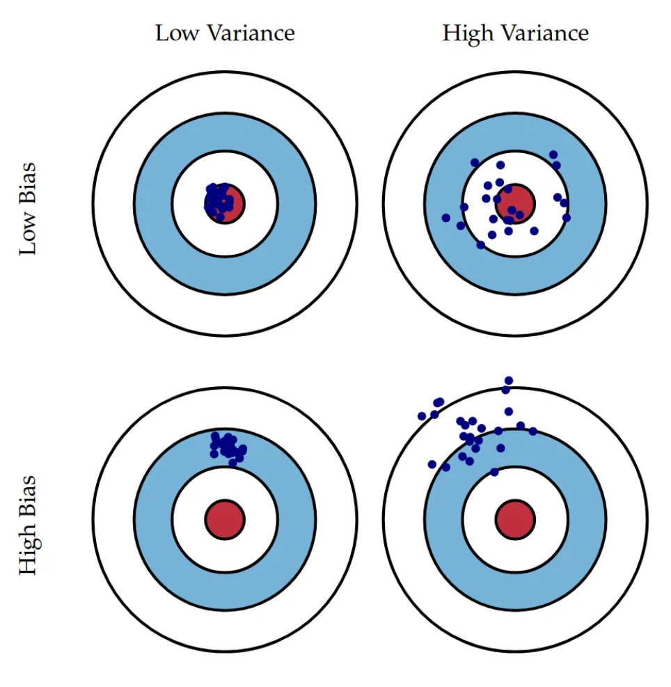

## Bias and Variance

 

**bias**
- 예측값과 정답 차이의 평균

**variance**
- 데이터셋에 대해 예측 값이 얼만큼 변할 수 있는지의 양
- high variace == high model flexibility

 

1. high bias 
-> 모델 복잡도 높임, 오랜 학습(more epoch)

2. high variance
-> 더 많은 데이터셋 구축, 정규화

  
  
  

Ref)

- https://www.youtube.com/playlist?list=PLkDaE6sCZn6Hn0vK8co82zjQtt3T2Nkqc