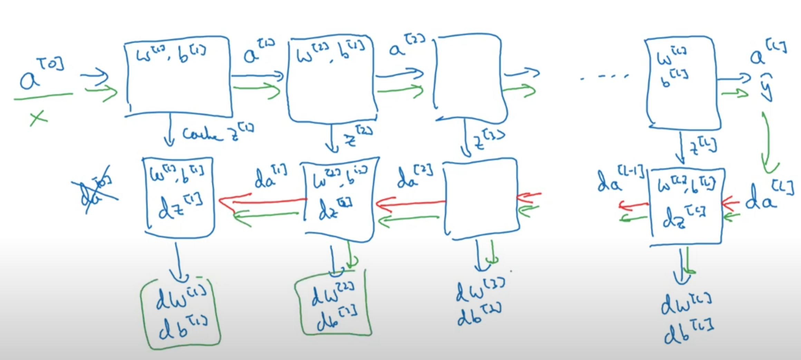

# Deep learning specialization - andrew ng

 

## activation function

**비선형 활성화 함수 사용하지 않는 다는 것은 은닉층이 없다는 말과 같음**

-> 딥러닝 의미 무색

 

### sigmoid
- 이진 분류 문제에서 출력층에 사용
- 평소엔 비추

### tanh
- 함수 특성상 데이터 중심을 0으로 만들어줌
-> 다음 학습 원활하게함
- sigmoid보다 추천

### Relu
- max(0, z)
- 대부분 사용

 

## Weight Initialization

### 은닉층의 가중치를 0으로 초기화 하면 안된다

-> 모든 input에 대해 항상 0을 출력하게 되어 첫번째 학습 이후에 계속해서 같은 계산만 반복 하게 됨

### 초기 가중치를 너무 큰값으로 설정하면 발생하는 문제

-> tanh, sigmoid 활성 함수에서 너무 크고 작은 값이 되어버려 기울기가 매우 작아지므로 학습 속도 저하

### weight initializations
- uniform distribution
- normal distribution
- Xavier 
- He

 

## Building Block for DNN

- 순전파 단계, 역전파 단계, 캐시
- 캐시 사용 이유
-> z, w, b를 캐시에 저장하여 역전파시 미분값 계산할 때 이용하기 위함

  
  
  

Ref)

- https://www.youtube.com/playlist?list=PLkDaE6sCZn6Ec-XTbcX1uRg2_u4xOEky0